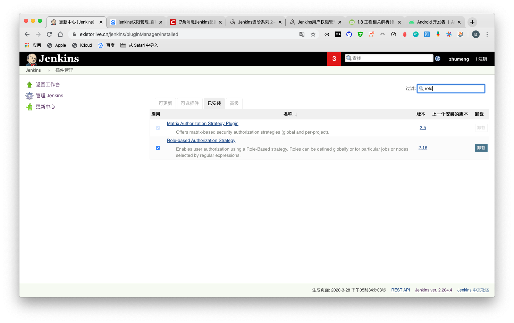
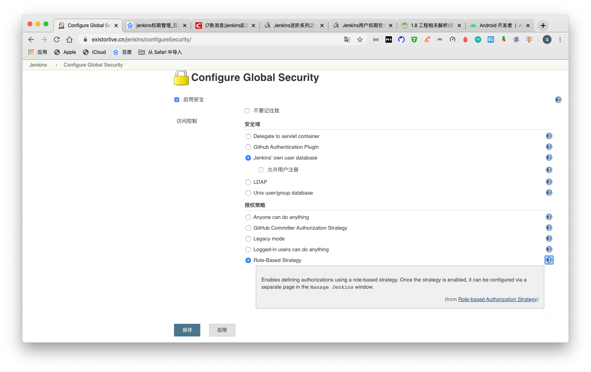
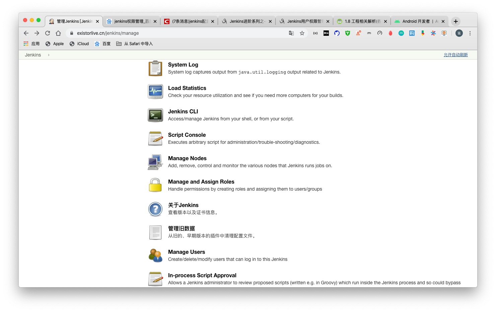
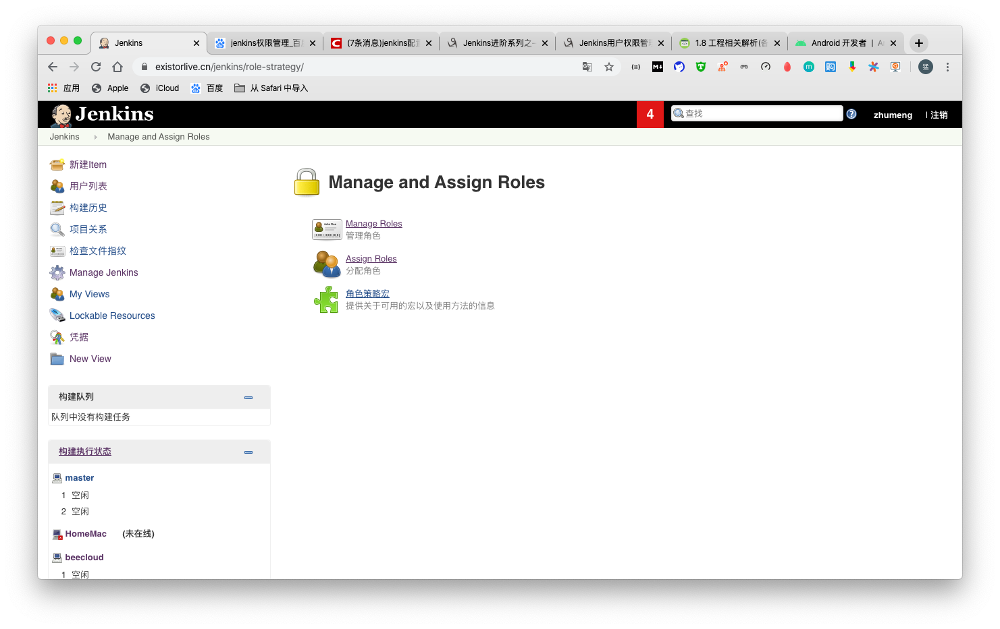
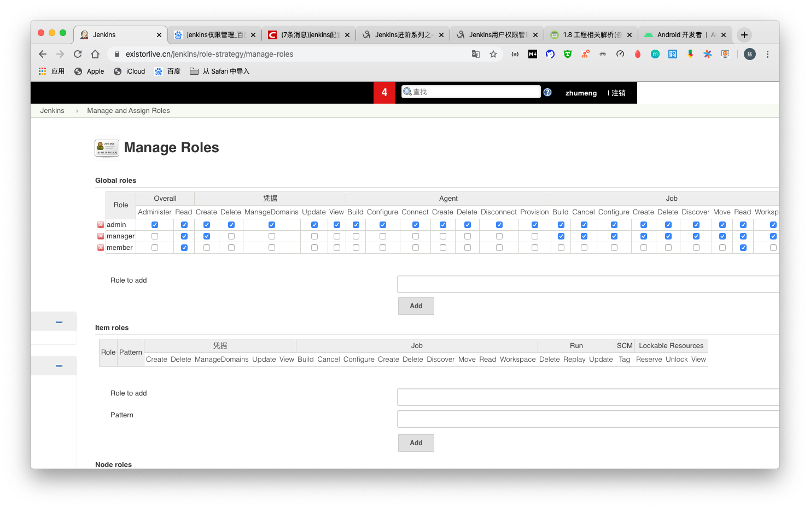
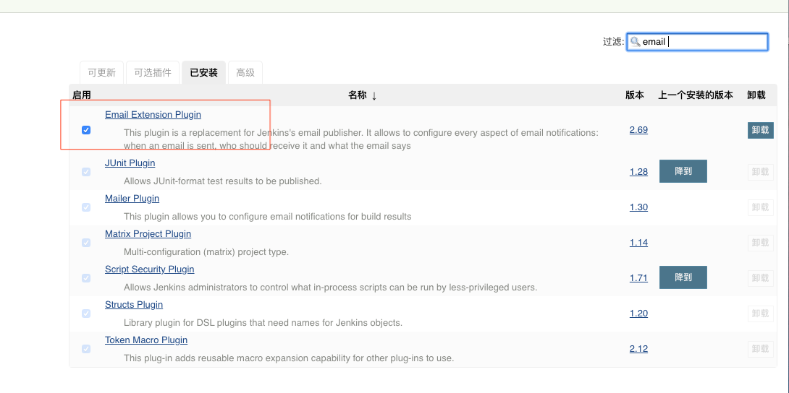
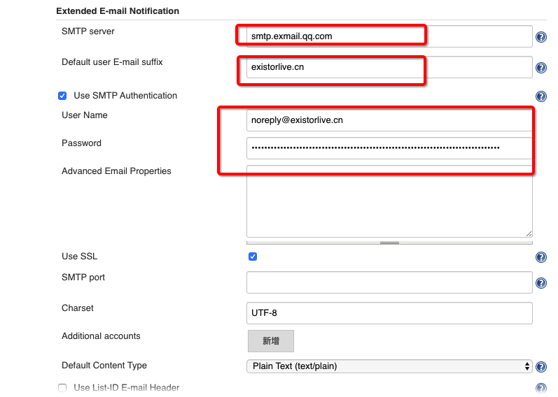
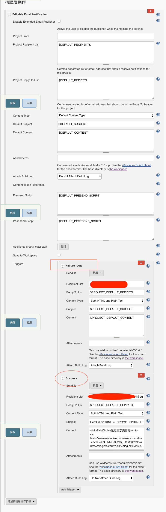

# Jenkins的常用插件

## 用户权限管理 （Role Strategy Plugin）

1. 下载插件 `Role-based Authorization Strategy`

     

2. 在`Configure Global Security`的授权策略中打开`Role-Based Strategy`

     

3. 设置中出现Manage and Assign Roles ， 进入后可以创建角色，设置角色的权限并给用户分配角色

     

     

4. 在Manage Roles中可以创建全局角色，job角色和node角色，可以为不同角色分配权限。在Assign Roles可以为用户分配角色

     

## 邮件发送 (Email Extension Plugin)

1. 下载 email extension plugin 插件

   

2. 在 `configure system`中出现 `Extended E-mail Notification`，在这里需要设置SMTP服务器，发送邮件所使用的邮箱账号。

   

3. 在对应item中配置`构建后操作`为`Editable Email Notification`。这里可以根据构建结果给不同的人发送不同内容的邮件
   
   

#### Tip
注意：Extended E-mail Notification 中配置的邮箱账号必须同系统管理员邮件地址一致

