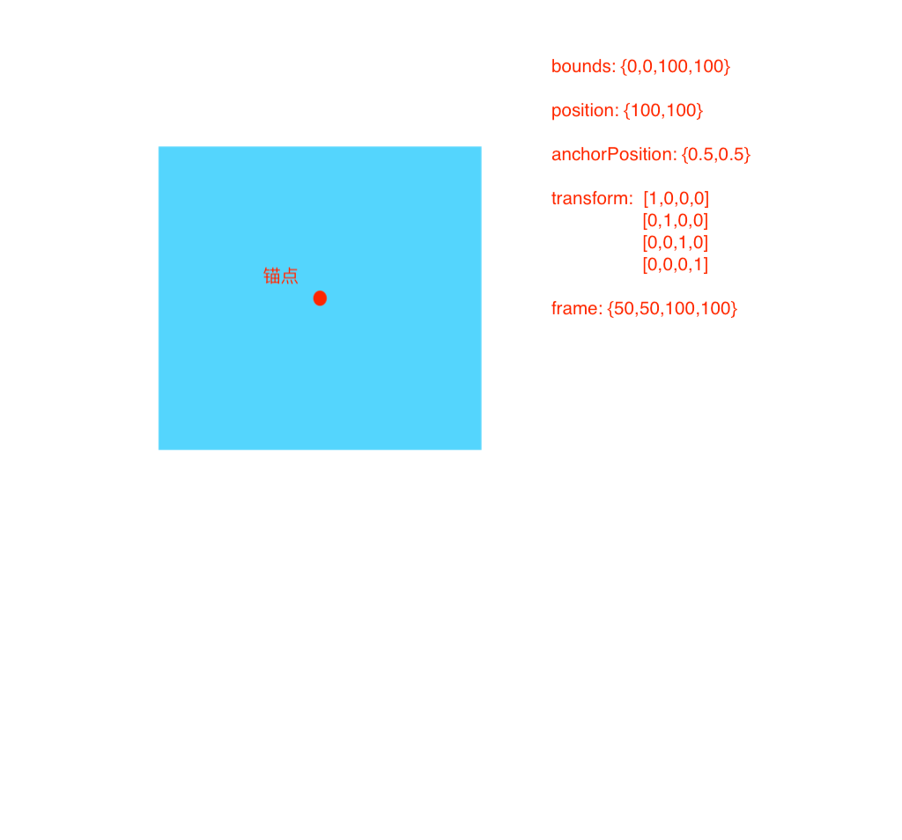
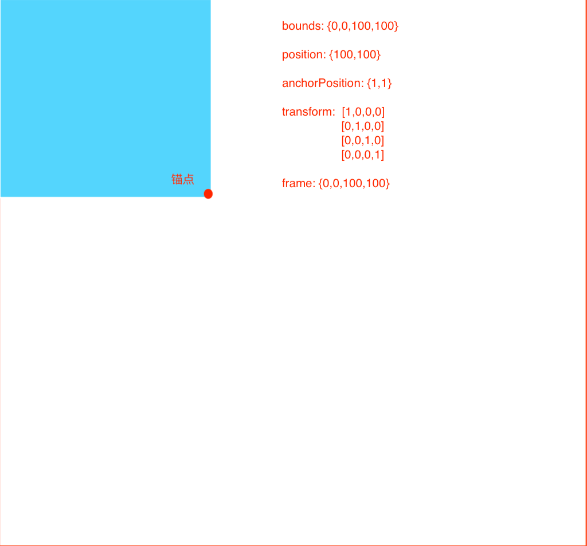
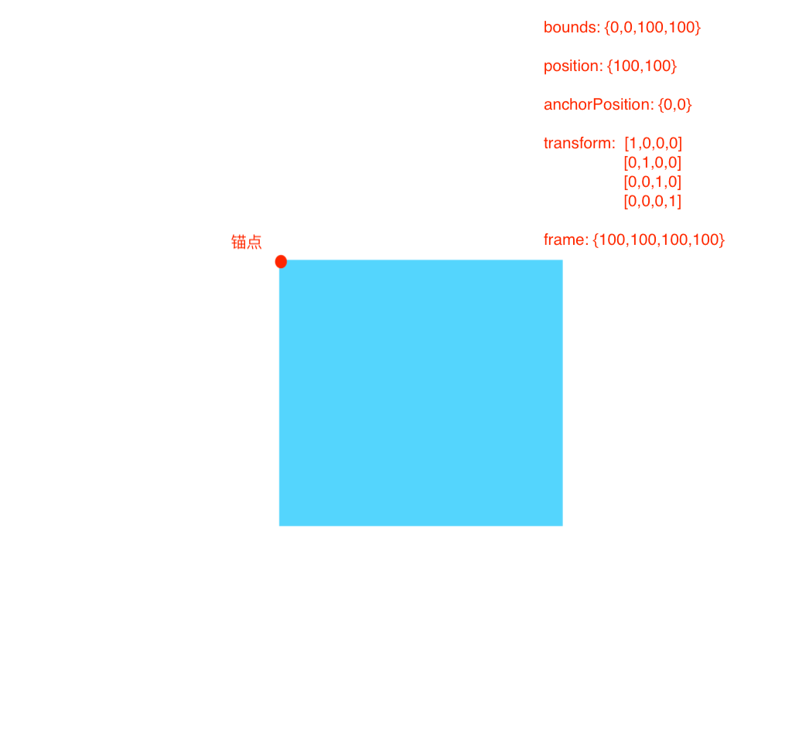
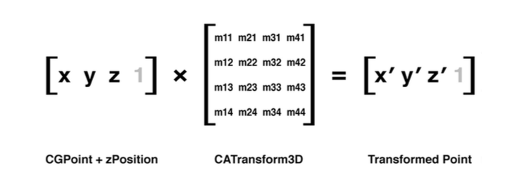
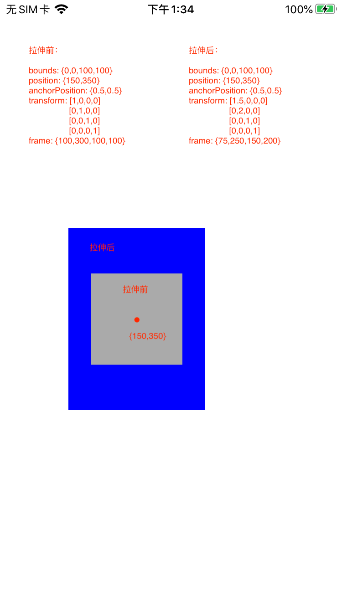
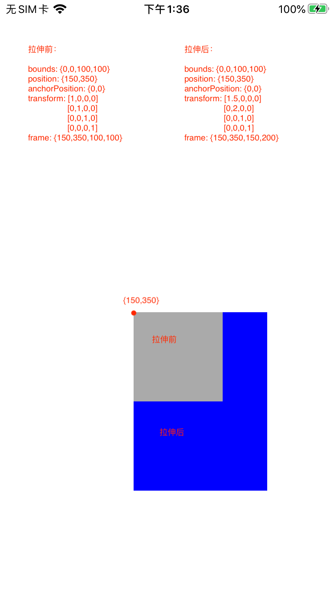
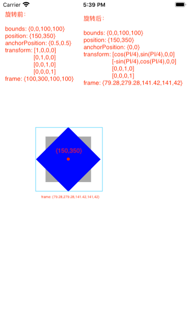
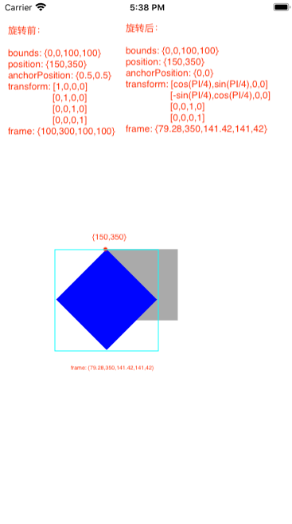

# CALayer 的 frame 的计算

> `frame` 代表图层或者视图在父图层或者父视图中的坐标和范围。`UIView`的`frame`属性是直接读取`CALayer`的`frame`属性。而`CALayer`的`frame`属性并没有关联实例变量，仅是setter和getter方法，是通过`bounds`,`position`,`anchorPosition`,以及`transform`等属性计算出来的。

- `bounds`属性代表的是图层的内部坐标或者说是图层的尺寸

- `position`属性代表的是图层的锚点在父图层中的坐标

- `anchorPosition`属性代表的图层的锚点在本图层中的相对位置

- `transform`属性代表的是图层的3D变换; `affineTransform`属性代表的图层的2D仿射变换，是`transform`属性转换得来

## 锚点

> 锚点是图层进行3D变换或者仿射变换的把柄。 例如如果做旋转变化，锚点就是旋转的轴心。

> 锚点的位置由`CALayer`的`anchorPoint`属性和`anchorPointZ`属性指定。`anchorPoint`的默认值为{0.5,0.5},代表图层的中心。`anchorPointZ`默认值为0。`anchorPointZ`代表是z轴上锚点的位置，这里暂不讨论。

锚点位置默认在图层的中心：{0.5,0.5}

锚点位置在图层 {1，1}

锚点位置 {0.5，0.5}

> 可以看到锚点位置不同，frame的值也不一样

## 变换

3D变化的基本公式：

> 其中[x,y,z,1] 在图层上任意一点在以锚点为原点的坐标系中的坐标；因此3D变化是以锚点为原点的坐标系中计算的，而不是在父视图的坐标系中。

由于frame只是二维上的概念，这里讨论的变化不涉及到三维：

### 平移变化 

将图层向右和向下各平移100个点，变换矩阵如下：

$$
 \begin{bmatrix}
   1 & 0 & 0 & 0 \\
   0 & 1 & 0 & 0 \\
   0 & 0 & 1 & 0 \\
   100 & 100 & 0 & 1
  \end{bmatrix}
$$

### 伸缩变化

将图层宽放大至1.5倍，高放大至2倍，变化矩阵如下：

$$
 \begin{bmatrix}
   1.5 & 0 & 0 & 0 \\
   0 & 2 & 0 & 0 \\
   0 & 0 & 1 & 0 \\
   0 & 0 & 0 & 1
  \end{bmatrix}
$$

锚点位置在中心：

锚点位置在左上角：

### 旋转变换

将图层以z轴为轴心顺时针旋转45度，变换矩阵如下：

$$
 \begin{bmatrix}
   cos(a) & sin(a) & 0 & 0 \\
   -sin(a) & cos(a) & 0 & 0 \\
   0 & 0 & 1 & 0 \\
   0 & 0 & 0 & 1
  \end{bmatrix}   a=PI/4
$$

锚点位置在中心：

锚点位置在左上角：

> 上面展示了3种基本的变换类型，平移变换，伸缩变化以及旋转变换。任何复杂的变换都是这三种变换组合得来。

由上面的例子可以得到：

- 变换前后bounds，position不变

- 变换会导致frame的变化

- 变换都是在以锚点为原点的坐标系中计算的

- frame指定的范围不一定等同于bounds指定的范围。frame指定的范围是一个恰好能够容纳图层且边分别平行于x轴与y轴的矩形区域

## 总结 

- `CALayer`和`UIView`的`frame`属性描述的是一个恰好能够容纳图层且边分别平行于x轴与y轴的矩形区域。

- `CALayer`和`UIView`的`frame`属性并不是一个实际存在的实例变量，是通过`bounds`,`anchorPosition`,`position`以及`transform`计算得来

- `frame`指定的范围不一定等同于`bounds`指定的范围
