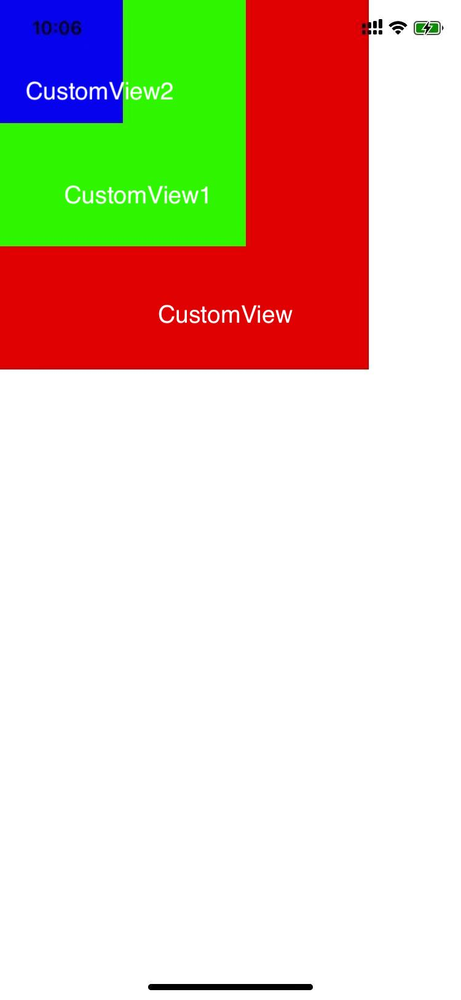
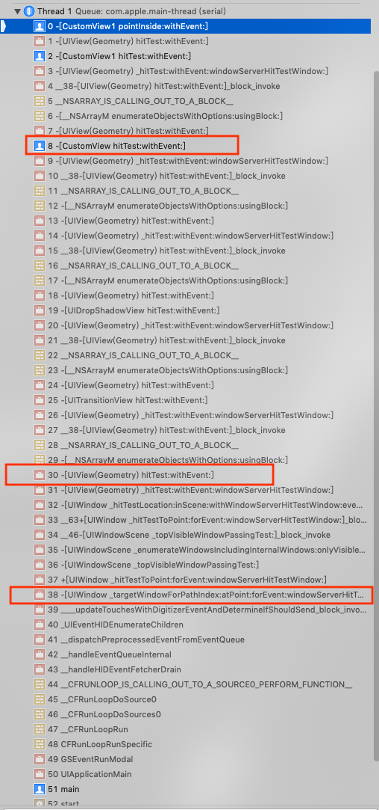
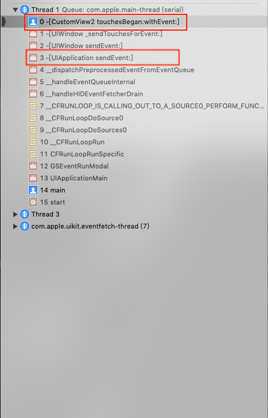
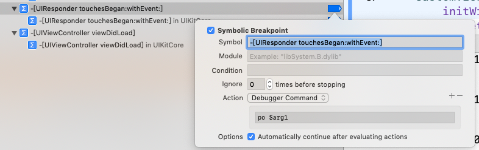
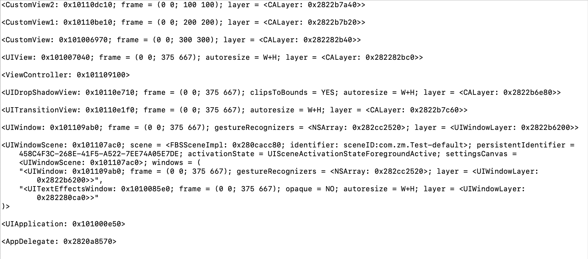

# Touch事件从始至终

> iOS系统在运行过程中，会收到各种不同的事件，包括`touch事件`，`motion事件`，`remote control事件`以及`press 事件`。`motion事件`指的是设备运动相关的事件，例如摇一摇等;`remote control`事件指的是收到外设(例如耳机)发出的命令，例如耳机控制音视频的播放;`press 事件`指的是游戏手柄，apple TV遥控器等有物理按钮的设备间的交互。我们这里只讨论`touch事件`与iOS设备屏幕的交互。

> 当点击屏幕时，iOS系统首先会收到touch事件并分派到相应的app，然后从UIWindow开始自下而上遍历图层，找到最上层touch事件点击的View，即first responder。如果first responder能够处理Touch事件，则触发事件响应的action；否则根据响应链寻找到能够处理Touch事件的Responder再处理事件。

> 如图所示，有以上的图层关系。

## 确定first responder

 当点击屏幕上CustomView2区域时，首先系统会收到touch事件，然后调用UIWindow的方法`[UIWindow _targetWindowForPathIndex:atPoint:forEvent:windowServerHitTestWindow:]`,该方法会遍历UIWindow的子视图，并调用子视图的`hitTest:withEvent:`确定first responder。

> `hitTest:withEvent:`方法作用是返回touch事件点击的view。如果touch事件没有点击在该view的范围中，则返回nil；如果点击在该view的范围中，则遍历子视图，调用子视图的`hitTest:withEvent:`方法。具体步骤如下：

1. 如果View `hidden`设置为YES,`alpha`设置为0或者`userInteractionEnabled`设置为NO，则表明view被隐藏或者不处理交互，直接返回nil；否则跳至步骤2

2. 如果view没有被隐藏，则调用`pointInside:withEvent:`方法，确定touch事件是否点击在view的范围中。如果`pointInside:withEvent:`返回YES，跳至步骤3；否则返回nil

3. 遍历子视图，调用子视图的`hitTest:withEvent:`,如果子视图返回为nil，则返回自己；如果子视图返回非nil，则返回子视图的结果

## 根据响应链查找可以处理事件的Responder

> 当通过`hitTest:withEvent:`确定了first responder，系统就会调用`UIApplication`的`sendEvent:`方法，将事件发送到first responder。

由上图1可以看到CustomView2直接收到了事件，并调用`touchesBegan:withEvent:`。

> 如果`UIResponder`的子类重写了`touchesBegan:withEvent:`等方法且没有在派生方法中调用父类的`touchesBegan:withEvent:`方法，则说明该view可以处理该事件，事件就会被拦截不会通过响应链向下传递。`UIControl`作为`UIResponder`的子类，重写了`touchesBegan:withEvent:`等方法，所以`UIButton`，`UISwitch`等收到事件，会直接阻止事件向下传递。而`UIView`，`UIImaeView`等则不会阻止事件的传递。

   

在这里，我们设置了符号断点，追踪了事件的传递。图1所示的`CustomView`，`CustomView1`，`CustomView2`都直接继承自`UIView`，且没有重写`touchesBegan:withEvent:`等方法，所以都不会拦截事件，事件会顺着响应链一直传递到`UIApplicationDelegate`(这里`UIApplicationDelegate`是`UIResponder`的子类)。可以看到事件的传递如下：

如果将`CustomView1` 改为继承自`UIControl`或者重写`touchesBegan:withEvent:`等方法,则会拦截事件不再传递。可以看到事件的传递如下：

## UIControl

[Using Responders and the Responder Chain to Handle Events][1]

[1]: https://developer.apple.com/documentation/uikit/touches_presses_and_gestures/using_responders_and_the_responder_chain_to_handle_events?language=objc

