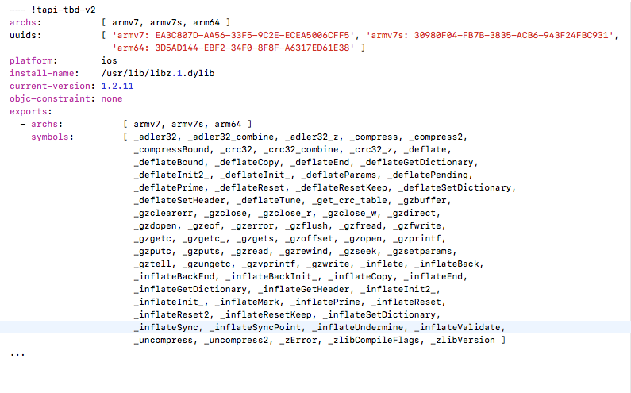

iOS 所有的依赖库都是在Build Phase 的 Link Binary With Libraries 中管理

- ####  \*.a   

静态库，一般由开发者生成          在使用*.a 需要指明 Libraries Search Path  和 Header Search Path  以及 提供相应的头文件

- #### *.framework     

framework 可以包含头文件和资源文件 .a 不能包含

开发者生成，为静态库       

系统framework， 为动态库

- #### *.dylib         

系统动态库，可在/usr/lib 中查找 

- #### *.tbd          

为动态库索引文件，以下为文件结构

