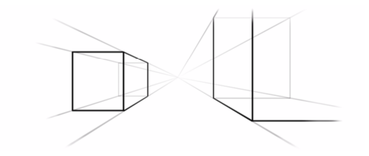
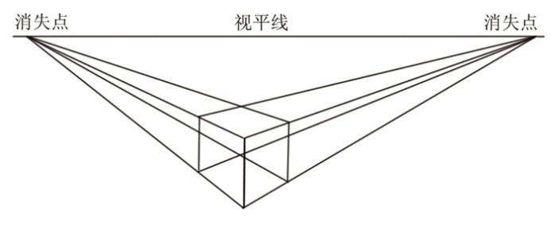
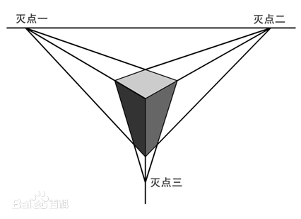

# 透视效果

在真实世界中，当物体远离我们的时候，由于视角的原因看起来会更小，远离我们视图的边要比靠近视角的边更短，虽然实际上并没有发生。因此为了3D效果更加契合人类的视觉习惯，我们这里引入`透视投影变换`的概念。

在3D变换的翻转变换中，翻转前后，原本平行的边仍然保持平行，在这种变换中远处的物体和近处的物体保持同样地缩放比例，这称为`等距投影变换`。而`透视投影变换`仅做了小小的修改：`CATransform3D`中的`m34`变量，用于按比例缩放X和Y的值来计算到底离视角多远。

`m34`的默认值为0，我们可以设置`m34`为 `-1.0/d`来应用透视效果，d 代表想象中的视角相机和屏幕之间的距离。


```objc

// 将图层设置透视效果，沿y轴正轴方向顺时针旋转45度
CATransform3D transform = CATransform3DIdentity;
transform.m34 = - 1.0 / 500;
transform = CATransform3DRotate(transform,  M_PI_4, 0, 1, 0);
```

<div align="center"></div>


## 灭点

当在透视角度绘图时，远离相机视角的物体会变小变远，当远离到一个极限距离，他们的三维线条会汇聚到到一个或者多个点，这些点称为`灭点`

平行透视（一个灭点）

<div align="center"></div>

成角透视 (两个灭点)

<div align="center"></div>

三点透视 (三个灭点)

<div align="center"></div>


在3D效果中，只有多个图层共享灭点，才能够显得逼真。图层共享灭点则需要`CALayer`的`position`保持一致。


## sublayerTransform 属性

如果有多个视图或者图层，每个都需要做3d变换，那就需要分别设置相同的m34,并确保变换之前都共享同一个position。

`CALayer`的`sublayerTransform`属性是`CATransform3D`类型，可以影响所有的子图层。这意味着可以一次性对包含这些图层的容器做变换。


