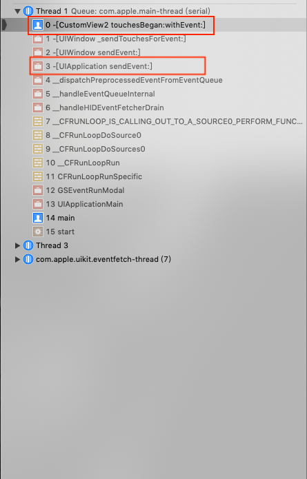
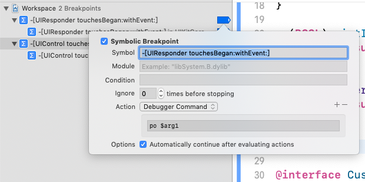
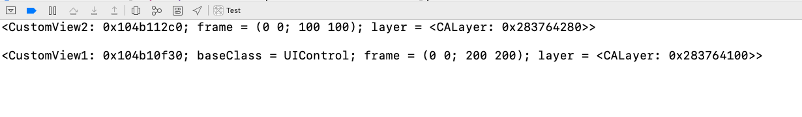
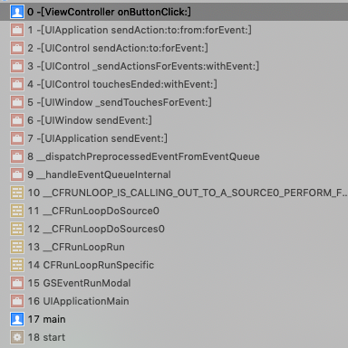
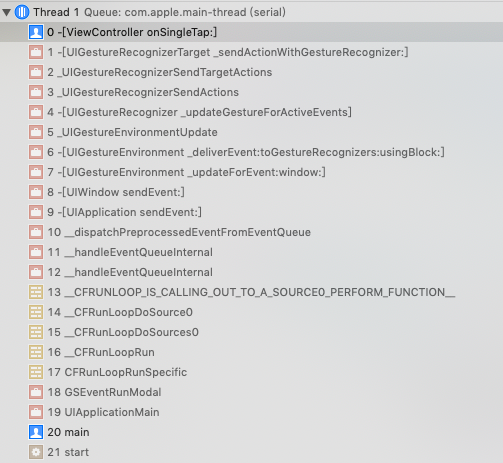

# Touch事件从始至终

iOS系统在运行过程中，会收到各种不同的事件，包括`touch事件`，`motion事件`，`remote control事件`以及`press 事件`。

- `touch事件` 指的是与设备屏幕间的交互

- `motion事件`指的是设备运动相关的事件，例如摇一摇等;

- `remote control`事件指的是收到外设(例如耳机)发出的命令，例如耳机控制音视频的播放;

- `press 事件`指的是游戏手柄，apple TV遥控器等有物理按钮的设备间的交互。


我们这里只讨论`touch事件`与iOS设备屏幕的交互。


 当点击屏幕时，iOS系统首先会收到`touch事件`并分派到相应的app，然后从`UIWindow`开始自下而上遍历图层，找到最上层touch事件点击的View，即`first responder`。如果`first responder`能够处理Touch事件，则触发事件响应的action；否则根据响应链寻找到能够处理 `touch事件` 的Responder再处理事件。

</br>

<div align="center"></div>

</br>


>如图所示，有以上的图层关系。


## 确定first responder

 当点击屏幕上CustomView2区域时，首先系统会收到`touch事件`，然后调用UIWindow的方法 `[UIWindow _targetWindowForPathIndex:atPoint:forEvent:windowServerHitTestWindow:]` ,该方法会遍历`UIWindow`的子视图，并调用子视图的 `hitTest:withEvent:` 确定first responder。

</br>

<div align="center"></div>

</br>


`hitTest:withEvent:`方法作用是返回touch事件点击的view。如果touch事件没有点击在该view的范围中，则返回nil；如果点击在该view的范围中，则遍历子视图，调用子视图的`hitTest:withEvent:`方法。具体步骤如下：

1. 如果view `hidden`设置为YES,`alpha`设置为0或者`userInteractionEnabled`设置为NO，则表明view被隐藏或者不处理交互，直接返回nil；否则跳至步骤2

2. 如果view没有被隐藏，则调用`pointInside:withEvent:`方法，确定touch事件是否点击在view的范围中。如果`pointInside:withEvent:`返回YES，跳至步骤3；否则返回nil

3. 遍历子视图，调用子视图的`hitTest:withEvent:`,如果子视图返回为nil，则返回自己；如果子视图返回非nil，则返回子视图的结果

## 根据响应链查找可以处理事件的Responder

当通过`hitTest:withEvent:`确定了first responder，系统就会调用`UIApplication`的`sendEvent:`方法，将事件发送到first responder。

<div align="center"></div>

> 由上图1可以看到CustomView2直接收到了事件，并调用`touchesBegan:withEvent:`。

```objc
/**
 * 通常情况下，任何UIResponder想要自定义的处理touch事件，都要实现以下4个方法。
 **/

- (void)touchesBegan:(NSSet<UITouch *> *)touches withEvent:(nullable UIEvent *)event;
- (void)touchesMoved:(NSSet<UITouch *> *)touches withEvent:(nullable UIEvent *)event;
- (void)touchesEnded:(NSSet<UITouch *> *)touches withEvent:(nullable UIEvent *)event;
- (void)touchesCancelled:(NSSet<UITouch *> *)touches withEvent:(nullable UIEvent *)event;
```

如果`UIResponder`的子类重写了`touchesBegan:withEvent:`等方法且没有在派生方法中调用父类的`touchesBegan:withEvent:`方法，则说明该view可以处理该事件，事件就会被拦截不会通过响应链向下传递。

`UIControl`作为`UIResponder`的子类，重写了`touchesBegan:withEvent:`等方法，所以`UIButton`，`UISwitch`等收到事件，会直接阻止事件向下传递;而`UIView`，`UIImaeView`等则不会阻止事件的传递。

<div align="center"></div>

</br>

> 在这里，我们设置了符号断点，追踪了事件的传递。图1所示的`CustomView`，`CustomView1`，`CustomView2`都直接继承自`UIView`，且没有重写`touchesBegan:withEvent:`等方法，所以都不会拦截事件，事件会顺着响应链一直传递到`UIApplicationDelegate`(这里`UIApplicationDelegate`是`UIResponder`的子类)。可以看到事件的传递如下：

</br>

<div align="center"></div>

</br>

> 如果将`CustomView1` 改为继承自`UIControl`或者重写`touchesBegan:withEvent:`等方法,则会拦截事件不再传递。可以看到事件的传递如下：

</br>

<div align="center"></div>

## UIControl

`UIControl`是`UIView`的子类，是可以响应特定的用户交互视觉元素。`Target-Action` 机制则是  
`UIControl` 去处理交互的机制。

```objc

- (void)addTarget:(nullable id)target action:(SEL)action forControlEvents:(UIControlEvents)controlEvents;
- (void)removeTarget:(nullable id)target action:(nullable SEL)action forControlEvents:(UIControlEvents)controlEvents;

```

> 这里我将 `CustomView1` 修改为 `UIButton` ,并设置target-action；在点击后，堆栈如下图所示

</br>
<div align="center"></div>
</br>

可以看到 `UIButton` 在 `touchesEnded:withEvent:` 方法中，

- 根据 `UITouch` 确定了 `UIControlEvents` , 然后确定相应的 `target` 和 `action`。
- `UIControl`调用 `sendAction:to:forEvent`方法 
- `UIApplication` 调用 `sendAction:to:from:forEvent`方法 
- 最终`target`调用`action`方法，即`-[ViewController onButtonClick:]` 

## UIGestureRecognizer

`touch事件` 在响应链中传递时，`UIGestureRecognizer` 会比它们的 `view` 先收到 `touch事件`。如果 `UIGestureRecognizer` 无法响应 `touch事件` ，`view` 才会收到并处理。

</br>
<div align="center"></div>
</br>


## 参考文档 


[Using Responders and the Responder Chain to Handle Events][1]

[UIResponder][2]

[UIEvent][3]

[iOS|事件传递及响应链](https://juejin.cn/post/6894518925514997767https://juejin.cn/post/6894518925514997767)

[1]: https://developer.apple.com/documentation/uikit/touches_presses_and_gestures/using_responders_and_the_responder_chain_to_handle_events?language=objc

[2]: https://developer.apple.com/documentation/uikit/uiresponder?language=objc

[3]: https://developer.apple.com/documentation/uikit/uievent?language=objc


