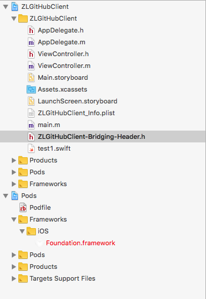
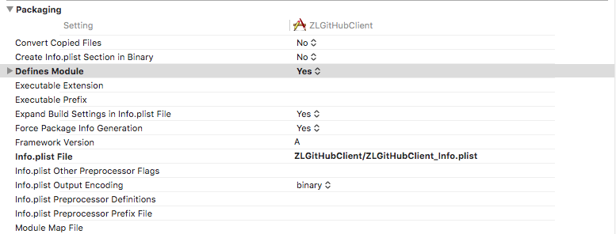
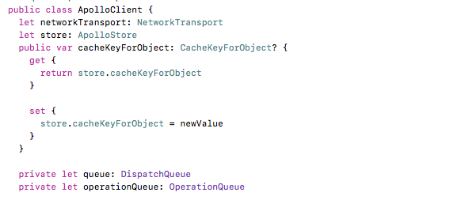
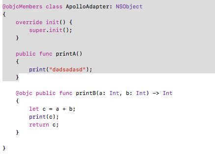

# OC工程引入Swift代码
#Swift和OC混编
#Swift 
#Objective-c

## OC工程通过Cocoapods引入Swift库

- Swift pod库只能够作为framework被引入工程，因此需要在Podfile文件中添加*use_frameworks!* 选项

- 如果编译报如下的错误

  *The “Swift Language Version” (SWIFT_VERSION) build setting must be set to a supported value for targets which use Swift. This setting can be set in the build settings editor.*

  需要设置pod库的**Build Setting**中的**Swift Language Version**选项

----

## OC工程添加Swift代码配置

- 建立桥接文件 工程名-Bridging-Header.h
  
  在OC工程中创建Swift文件，会弹出提示框，要求创建桥接文件

  ![桥接文件1][pic/桥接文件1.jpg]

  生成桥接文件`ZLGithubClient-Bridging-Header.h`如下

  

- Build Settings 配置

  设置Define Module为YES

  

  设置Product Module Name 为当前工程名

  

  设置完之后，系统会为工程自动创建一个`工程名-Swift.h`的头文件(该文件在bundle中不可见)；
  
  在需要调用Swift代码的文件中引入该头文件。

----

## OC 中引入swift代码

> 在OC中不能够直接编写swift的代码；只能够编写swift转换后的OC代码。但是swift代码必须要满足以下的条件才能够转换

- swift类必须继承NSObject类或者它的子类
  
  

  如图ApolloClient没有继承NSObject，不能够被转换
  
  
  
  如果ApolloAdapter继承了NSObject，可以被转换

- 在Swift 4.0的版本，定义类前必须加上@objcMembers,需要被转换的方法前需要加上@objc； 如上图所示

[OC调用Swift4.0的各种坑][9]

## 参考文档

[Podfile中的use_frameworks!](https://www.jianshu.com/p/c8dadf10ec98)

[在OC项目中引入Swift的方法](https://www.jianshu.com/p/a342fba7f418)

[OC 调用 Swift 方法](https://blog.csdn.net/qin_shi/article/details/82458916)

[Swift与OC混编](https://www.jianshu.com/p/69ba19692bae)

[OC调用Swift4.0的各种坑](https://blog.csdn.net/u012338816/article/details/83176751)

