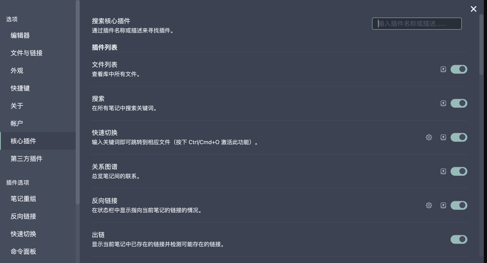
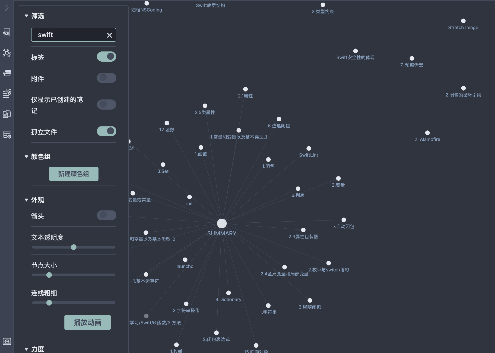
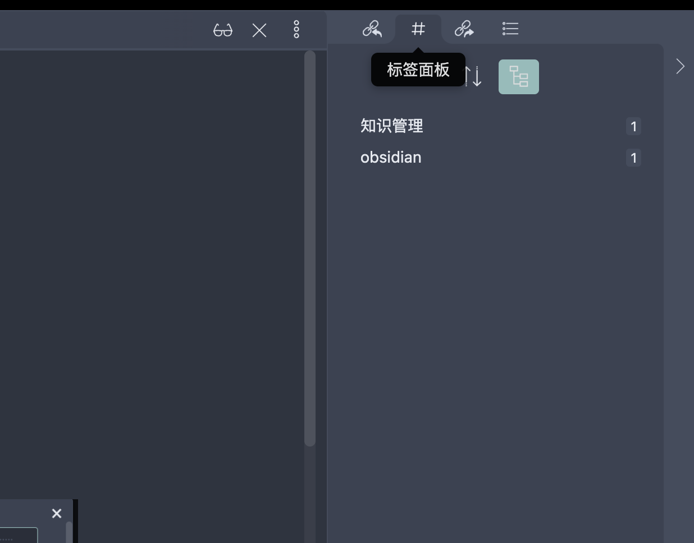
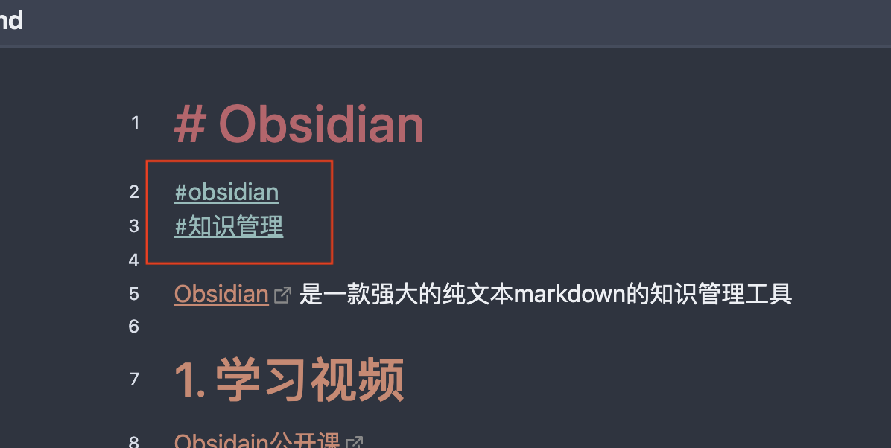

# Obsidian 
#obsidian 
#知识管理

[Obsidian](https://obsidian.md/) 是一款强大的纯文本markdown的知识管理工具

## 1. 学习视频
[Obsidain公开课](https://www.bilibili.com/video/BV1H44y1n71k/?spm_id_from=333.788)

## 2. 核心插件
Obsidian 初始设置非常简单，大部分的核心能力需要打开对应的核心插件来使用：

- 文件列表
- 搜索
- 快速切换
- 关系图谱
      显示知识库中文章之间的引用关系 
      
- 反向链接
- 出链

## 3. 标签

obsidian 的标签功能够帮我快速分类和查找知识，首先需要打开核心插件中的标签面板

在右侧窗口中查看标签面板

  
在文档中通过`#标签`的方式为文档添加标签，注意 `#` 和标签之间不可以有空格	 
	 

## 4. 模版
在核心插件中，可以设置文档的模版

